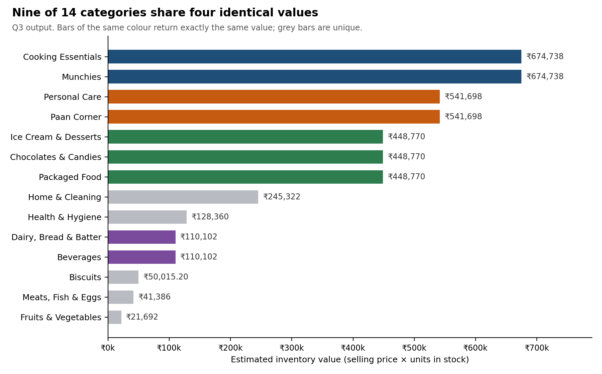

# Zepto Inventory Analysis (SQL)

SQL analysis of 7,462 Zepto product listings covering discounts, stock availability, pricing and inventory. Includes data cleaning, eight business queries, and a data quality issue that affects category-level reporting.

Zepto is an Indian quick-commerce grocery delivery service. This project takes the view of an analyst reviewing its product catalogue: what is listed, what is out of stock, how it is priced and discounted, and whether the data is reliable enough to report on.

**Tools:** PostgreSQL 18, pgAdmin 4

**Credit:** built on [Amlan Mohanty's Zepto SQL project](https://github.com/amlanmohanty/zepto-SQL-data-analysis-project), which provides the schema and the eight queries; the dataset was originally published on Kaggle. The findings, cross-query validation, data quality investigation, recommendations and limitations below are my own work.

---

## Key Findings

| Area | Finding |
|---|---|
| Stock | 906 of 7,462 listings (12.1%) are out of stock. Four have an MRP above ₹300, led by Patanjali Cow's Ghee (₹565) |
| Discounts | Highest discount is 51%. Fruits & Vegetables have the highest average discount (15.46%), then Meats, Fish & Eggs (11.03%) |
| Pricing | Oil jars with an MRP of ₹1,050 to ₹1,250 carry discounts of 0% to 8% (Q4 output) |
| Data quality | Several categories return identical totals in three separate queries; the 14 categories reduce to 9 distinct profiles |

## Dataset

`zepto_v2.csv`: 7,462 rows, 14 categories, one row per SKU. Columns: `category`, `name`, `mrp`, `discountPercent`, `availableQuantity`, `discountedSellingPrice`, `weightInGms`, `outOfStock`, `quantity`. Prices are stored in paise and converted to rupees during cleaning. `sku_id` is generated on import.

## Project Workflow

### 1. Set up the database

I created a PostgreSQL table with data types chosen to match the data: `NUMERIC` for prices and discounts (exact decimals, no floating-point rounding), `BOOLEAN` for stock status, a generated `sku_id` as primary key, and `NOT NULL` on product name.

```sql
CREATE TABLE zepto (
  sku_id SERIAL PRIMARY KEY,
  category VARCHAR(120),
  name VARCHAR(150) NOT NULL,
  mrp NUMERIC(8,2),
  discountPercent NUMERIC(5,2),
  availableQuantity INTEGER,
  discountedSellingPrice NUMERIC(8,2),
  weightInGms INTEGER,
  outOfStock BOOLEAN,
  quantity INTEGER
);
```

### 2. Import the data

I loaded `zepto_v2.csv` with pgAdmin's import feature, leaving out `sku_id` so PostgreSQL generates it.

### 3. Explore

Before analysing anything, I checked what the data looked like: row count, a sample of rows, nulls in every column, the list of categories, the in-stock and out-of-stock split, and product names that appear more than once.

Result: no nulls; 6,556 in stock and 906 out of stock; 1,680 product names appear more than once.

<details>
<summary>Exploration queries</summary>

```sql
SELECT COUNT(*) FROM zepto;

SELECT * FROM zepto LIMIT 10;

SELECT * FROM zepto
WHERE name IS NULL OR category IS NULL OR mrp IS NULL
   OR discountPercent IS NULL OR discountedSellingPrice IS NULL
   OR weightInGms IS NULL OR availableQuantity IS NULL
   OR outOfStock IS NULL OR quantity IS NULL;

SELECT DISTINCT category FROM zepto ORDER BY category;

SELECT outOfStock, COUNT(sku_id) FROM zepto GROUP BY outOfStock;

SELECT name, COUNT(sku_id) AS "Number of SKUs"
FROM zepto
GROUP BY name
HAVING COUNT(sku_id) > 1
ORDER BY COUNT(sku_id) DESC;
```

</details>

### 4. Clean

I checked for products with a zero price (none found) and converted `mrp` and `discountedSellingPrice` from paise to rupees.

```sql
DELETE FROM zepto WHERE mrp = 0 OR discountedSellingPrice = 0;   -- 0 rows affected

UPDATE zepto
SET mrp = mrp / 100.0,
    discountedSellingPrice = discountedSellingPrice / 100.0;
```

### 5. Analyse

Eight queries using aggregates, `GROUP BY` / `HAVING`, `CASE WHEN`, `DISTINCT`, sorting and limits. Two examples:

```sql
-- Q3: estimated inventory value by category
SELECT category,
       SUM(discountedSellingPrice * availableQuantity) AS total_revenue
FROM zepto
GROUP BY category
ORDER BY total_revenue DESC;

-- Q7: weight bands
SELECT DISTINCT name, weightInGms,
  CASE WHEN weightInGms < 1000 THEN 'Low'
       WHEN weightInGms < 5000 THEN 'Medium'
       ELSE 'Bulk'
  END AS weight_category
FROM zepto;
```

The column alias `total_revenue` in Q3 is only a label. The figure is selling price × units in stock, so it measures estimated inventory value, not sales.

### 6. Validate

I confirmed that stock counts sum to the row count, recomputed the Q6 price-per-gram values, and compared results across queries. That comparison is what exposed the category problem described below.

## Business Questions and Results

| # | Question | Result |
|---|---|---|
| Q1 | Top 10 products by discount | Three Dukes Waffy wafers at 51%; seven products at 50% |
| Q2 | Out-of-stock products with MRP above ₹300 | Cow's Ghee ₹565, MamyPoko Pants XL ₹399, Aashirvaad Multigrain Atta ₹315, Everest Kashmiri Lal Chilli Powder ₹310 |
| Q3 | Estimated inventory value by category | Cooking Essentials and Munchies tied at ₹674,738; Fruits & Vegetables lowest at ₹21,692 |
| Q4 | MRP above ₹500 and discount below 10% | Rows shown are oil jars with 0% to 8% discounts |
| Q5 | Top 5 categories by average discount | Fruits & Vegetables 15.46%, Meats, Fish & Eggs 11.03%, three categories tied at 8.32% |
| Q6 | Price per gram (products of 100 g or more) | 1,395 products; lowest are Vicks Cough Drops (₹0.0172/g), iodised salt and onions (about ₹0.019/g) |
| Q7 | Weight bands: Low (under 1 kg), Medium (1 to under 5 kg), Bulk (5 kg and above) | 1,782 distinct product and weight combinations classified |
| Q8 | Total inventory weight by category | Munchies and Cooking Essentials tied at 2,809,308 g; Meats, Fish & Eggs lowest at 96,032 g |

## Data Quality Issue

Categories in these groups return identical value, weight and (where shown) average discount:

| Categories | Est. inventory value | Total weight |
|---|---|---|
| Cooking Essentials · Munchies | ₹674,738 | 2,809,308 g |
| Personal Care · Paan Corner | ₹541,698 | 696,374 g |
| Ice Cream & Desserts · Chocolates & Candies · Packaged Food | ₹448,770 | 981,594 g |
| Dairy, Bread & Batter · Beverages | ₹110,102 | 287,470 g |



The same groups appear in Q3 and Q8, and the three-way tie in Q5 (8.32%) matches the third group, so coincidence is very unlikely. The likely cause is the same products listed under several categories; this is inferred from the totals and not yet tested row by row. If correct, summing all 14 categories (₹4,486,161.20) overstates the 9 distinct values (₹2,262,083.20), so category rankings should be used with caution. Product-level results (Q1, Q2, Q4, Q6) are less affected.

Other checks: stock counts sum to the row count (6,556 + 906 = 7,462), and Q6 price-per-gram values were recomputed and match. One value looks wrong: Vicks Cough Drops at 1,160 g for ₹20.

## Recommendations

- Check and restock the four high-MRP out-of-stock items first.
- Test a small promotion on premium cooking oils.
- Review whether the deep Fruits & Vegetables discounts are justified; they have the highest average discount but the lowest estimated inventory value.
- Fix category mapping before any category-level reporting.

These are hypotheses: the data has stock levels but no sales.

## Repository

```
Zepto_SQL_data_analysis.sql   schema, exploration, cleaning, analysis (Q1 to Q8)
zepto_v2.csv                  dataset
images/                       chart used in this README
README.md
```

**To run:** create a database, run the schema section, import `zepto_v2.csv` (leave out `sku_id`), then run exploration, cleaning and analysis. Run the cleaning step once only. Re-running the schema section deletes the data, and re-running the paise-to-rupee `UPDATE` divides prices by 100 again.

## Limitations

- Inventory value and weight reflect current stock, not sales.
- The `quantity` column is undocumented and was not used.
- Q4, Q6 and Q7 conclusions are based on the rows shown in the output.

---

**Imane Khtib** | khtibimane23@gmail.com
